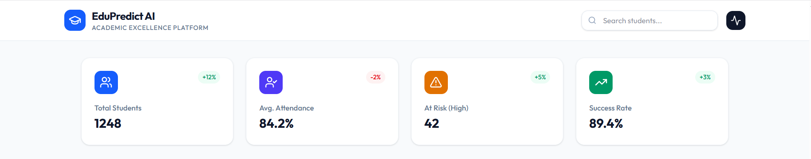
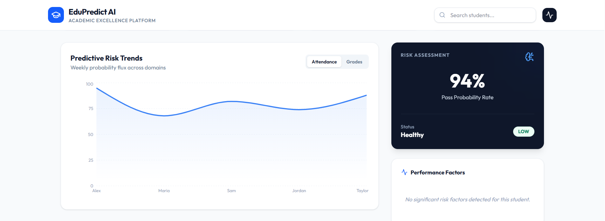
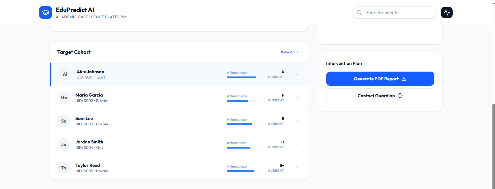
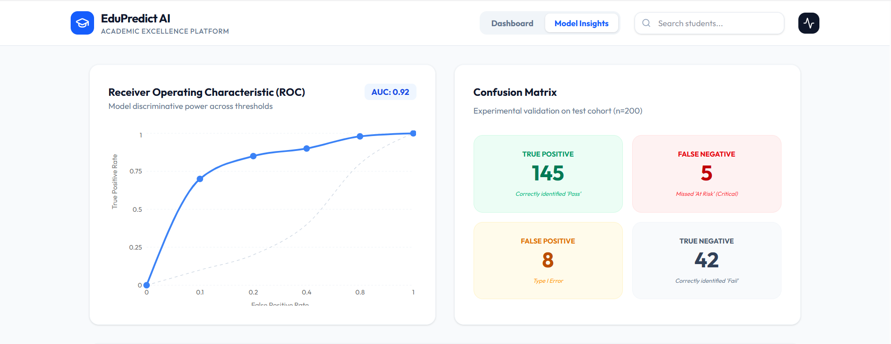
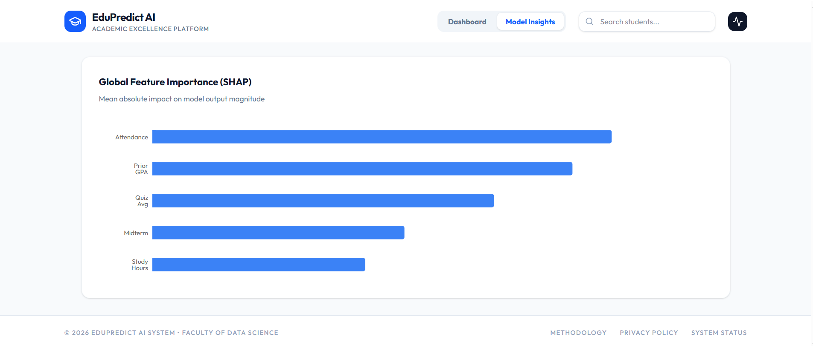

# 🎓 Student Performance Prediction System

🚀 End-to-end Machine Learning system to predict student performance and identify at-risk learners using behavioral and academic signals.

> Achieves **0.92 ROC-AUC** and **0.88 F1 Score**, with real-time predictions via FastAPI and an interactive dashboard for academic intervention.

---

## 💡 Key Highlights
- 📊 Predicts student success using XGBoost (Optuna tuned)
- ⚡ Real-time inference using FastAPI
- 📉 Identifies at-risk students with probability scoring
- 🧠 SHAP-based explainability (Glass-box AI)
- 🖥️ Interactive React dashboard for advisors
- ⚙️ Production-ready with Docker + drift detection

## 🛠️ Tech Stack

- **Machine Learning:** XGBoost, Scikit-learn, Optuna, SHAP  
- **Backend:** FastAPI, Node.js (Express)  
- **Frontend:** React, Tailwind CSS, Recharts  
- **MLOps:** Docker, Drift Detection (KS Test)  

## 📂 Data Source

- Synthetic dataset generated using realistic academic distributions  
- Designed to simulate real-world student behavior and performance patterns  

## 📸 Project Screenshots

### 📊 Dashboard Overview


### 📈 Predictive Risk Analysis


### 👨‍🎓 Student Cohort & Intervention


## 📊 Model Insights

### 📊 Model Evaluation (ROC Curve & Confusion Matrix)


### 🧠 Model Explainability (SHAP Feature Importance)


## 🏗️ System Architecture


```text
Data → Preprocessing → XGBoost Model → FastAPI → Dashboard → Intervention Engine
```

### Components:
- **ML Layer:** XGBoost + Optuna + SHAP
- **Backend:** FastAPI + Express proxy
- **Frontend:** React + Tailwind + Recharts
- **Deployment:** Docker + Cloud hosting

## ⚡ Run Locally

### Backend (FastAPI)
```bash
cd api
pip install -r requirements.txt
uvicorn main:app --reload
```

### Frontend
```bash
npm install
npm run dev
```

## 📊 Model Performance

| Metric | Score |
|--------|------|
| F1 Score | 0.88 |
| ROC-AUC | 0.92 |
| Precision | 0.84 |
| Recall | 0.87 |

> Optimized using Optuna with 5-fold cross-validation

## 🔌 API Example

### POST /api/predict
```json
{
  "attendance_pct": 72,
  "prior_gpa": 3.0,
  "quiz_avg": 58,
  "study_hours_wk": 6
}
```

**Response**
```json
{
  "risk_prob": 0.78,
  "at_risk": true
}
```

## 🌐 Live Demo

🚀 [**Open Dashboard**](https://ais-pre-unadixb7ocscnnzrhxp3wj-50948685477.asia-southeast1.run.app)

> If the demo does not load, try opening in an incognito window.

## 🎯 Why This Project?

- Helps institutions reduce dropout rates
- Enables early intervention for struggling students
- Supports data-driven academic decisions
- Mirrors real-world EdTech analytics systems

## 🧾 Resume Summary

Built an end-to-end ML system using XGBoost to predict student performance, achieving 0.92 ROC-AUC. Developed FastAPI inference service and React dashboard with SHAP-based explainability to identify at-risk students and drive intervention strategies.

---
**Student Performance Prediction System** | Built for DS/ML Placement Portfolio | 2026
